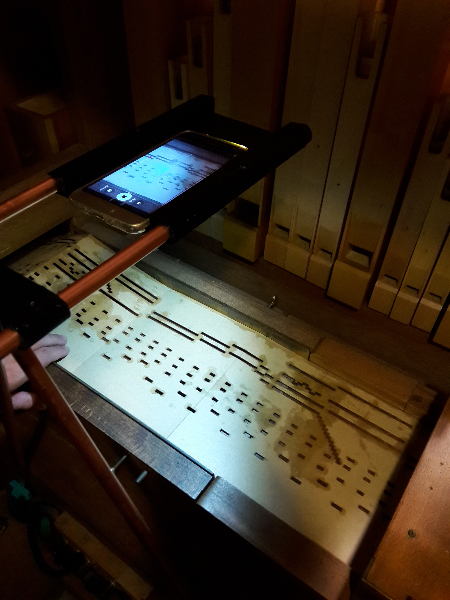
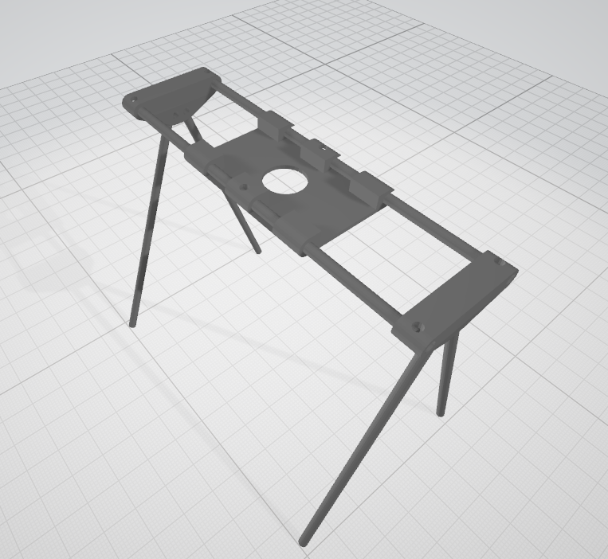
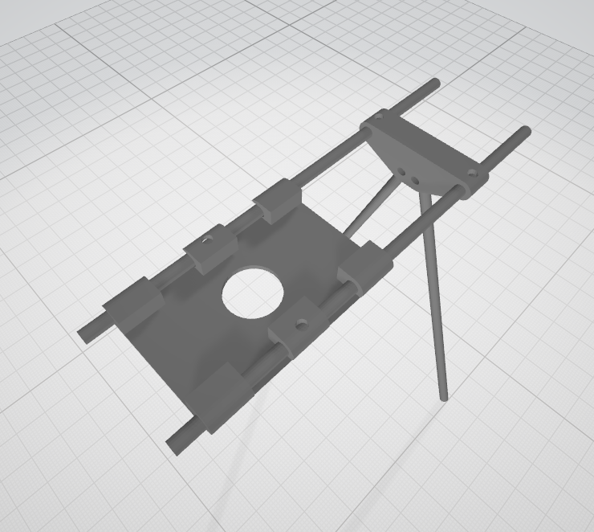
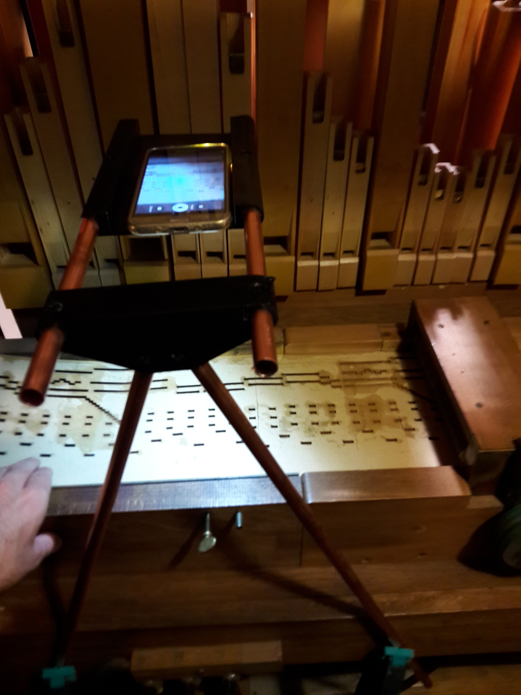
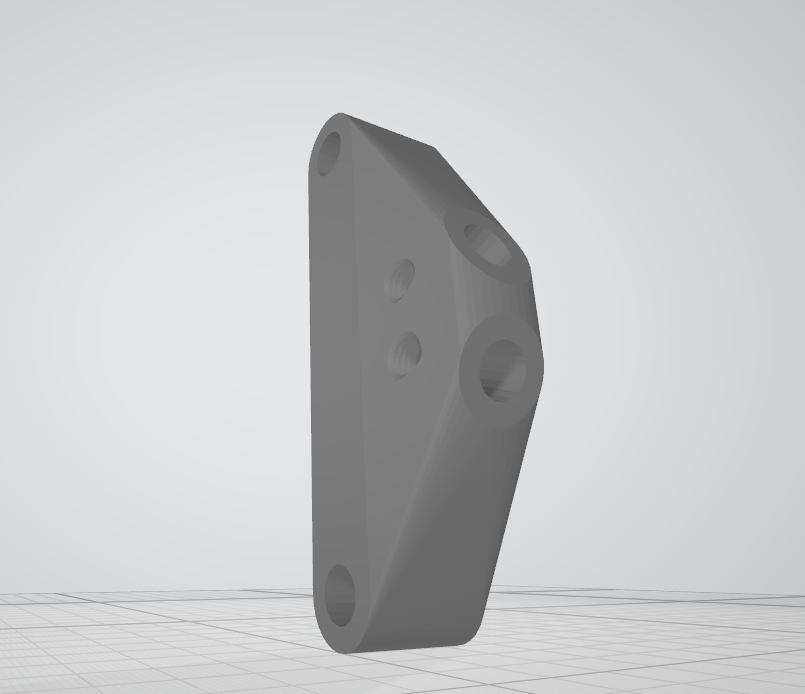
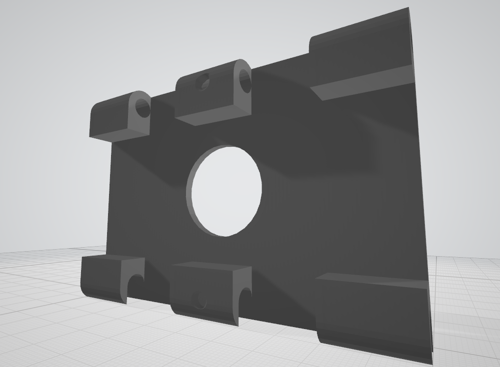

# Books scanner support for smartphone and cameras

*Patrice Freydiere - 2019-07*

This project aim to provide a **light** and precise **3D printed support** to permit to **scan barrel organ books**. This element permit to use then **APrint Studio** to convert the videos into actionable Midi files.

The 3D model is parametric, using OpenScad 2019, so you can **adjust** the sizes and **tube diameters**. Please look at the [OpenScad](<https://www.openscad.org/>)  web site to have more informations.

This 3D support only permit to have normalized images to narrow the number of glitches to correct. For a full scan it need a constant displacement of the underlying book. This can be done on <u>regulated  powered Organ</u> or using a <u>specialized displacement system</u> as here [Operational Book scanning using GRBLPunch and APrint Studio](<https://www.facebook.com/BarrelOrganDiscovery/videos/vl.651768338588622/649677052129901/?type=1>)

## The design

Two configurations of the support full or half, 

of half configuration :

## Images

Half configuration in place on a 52 limonaire organ to scan book :

## Parts

In Minimal design, it use 2 pieces : corner and horizontal_support. 

plus 4, 12mm diameter tubes. Easy !

The corner hosting both the vertical tube supports and horizontal elements : 

the horizontal support, permitting to place the smartphone or camera :

all files are in parts/ 

